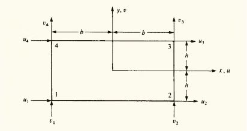

#### 节点位移矩阵

$$
\{d\} = \begin{Bmatrix}
d_1 \\
d_2 \\
d_3 \\
d_4
\end{Bmatrix} = \begin{Bmatrix}
u_1 \\
v_1 \\
u_2 \\
v_2 \\
u_3 \\
v_3 \\
u_4 \\
v_4
\end{Bmatrix}
$$

#### 选择位移函数

$$
\begin{cases}
u(\xi, \eta) = a_1 + a_2 \xi + a_3 \eta + a_4 xy \\
v(\xi, \eta) = b_1 + b_2 \xi + b_3 \eta + b_4 xy
\end{cases}
$$

消去 $a, b$ 得

$$
\begin{cases}
u(\xi, \eta) = \frac{1}{4bh} \left[ (m - \eta)(l - \xi)u_1 + (m + \eta)(l - \xi)u_2 + (m + \eta)(l + \xi)u_3 + (m - \eta)(l + \xi)u_4 \right] \\
v(\xi, \eta) = \frac{1}{4bh} \left[ (m - \eta)(l - \xi)v_1 + (m + \eta)(l - \xi)v_2 + (m + \eta)(l + \xi)v_3 + (m - \eta)(l + \xi)v_4 \right]
\end{cases}
$$

$$
\{\psi\} =
\begin{bmatrix}
u(\xi, \eta) \\
v(\xi, \eta)
\end{bmatrix} = [N] \{d\}
$$

形函数如下

$$
[N] = \begin{bmatrix}
N_1 & 0 & N_2 & 0 & N_3 & 0 & N_4 & 0 \\
0 & N_1 & 0 & N_2 & 0 & N_3 & 0 & N_4
\end{bmatrix}
$$

其中

$$
\begin{matrix}
N_1 = \frac{1}{4bh} (m - \eta)(l - \xi) & N_2 = \frac{1}{4bh} (m + \eta)(l - \xi) \\
N_3 = \frac{1}{4bh} (m + \eta)(l + \xi) & N_4 = \frac{1}{4bh} (m - \eta)(l + \xi)
\end{matrix}
$$

#### 坐标转换

为了简便运算，将$x-y$坐标系的四边形转换为$\xi-\eta$坐标系下的以原点为中心，边长为 2 的正方形，变换关系为

$$
\begin{cases}
x = x_0 + m \xi \\
y = y_0 + l \eta
\end{cases}
$$

其中 $x_0, y_0$ 的单元中心坐标

设 $x-y$ 坐标转换为 $\xi-\eta$ 坐标函数为

$$
\begin{cases}
x = a_1 + a_2 \xi + a_3 \eta + a_4 \xi \eta \\
y = b_1 + b_2 \xi + b_3 \eta + b_4 \xi \eta
\end{cases}
$$

由 $(1, 1)$, $(1, -1)$, $(-1, -1)$, $(-1, 1)$ 四个节点坐标在 $\xi-\eta$ 坐标系下的坐标为 $(1, 1)$, $(1, -1)$, $(-1, -1)$, $(-1, 1)$，对应的 $\xi-\eta$ 坐标为 $(x_1, y_1)$, $(x_2, y_2)$, $(x_3, y_3)$, $(x_4, y_4)$。可以解出 $a_1, a_2, a_3, a_4, b_1, b_2, b_3, b_4$ 的值。

因此 $\xi-\eta$ 坐标转换为 $\xi-\eta$ 坐标函数为

$$
\begin{cases}
\xi = \frac{1}{4} \left[(1 - \xi)(1 - \eta)x_1 + (1 + \xi)(1 - \eta)x_2 + (1 + \xi)(1 + \eta)x_3 + (1 - \xi)(1 + \eta)x_4\right] \\
\eta = \frac{1}{4} \left[(1 - \xi)(1 - \eta)y_1 + (1 + \xi)(1 - \eta)y_2 + (1 + \xi)(1 + \eta)y_3 + (1 - \xi)(1 + \eta)y_4\right]
\end{cases}
$$

即

$$
\begin{Bmatrix}
\xi \\
\eta
\end{Bmatrix} = [N] \{d\} =
\begin{bmatrix}
N_1 & 0 & N_2 & 0 & N_3 & 0 & N_4 & 0 \\
0 & N_1 & 0 & N_2 & 0 & N_3 & 0 & N_4
\end{bmatrix}
\begin{Bmatrix}
x_1 \\
y_1 \\
x_2 \\
y_2 \\
x_3 \\
y_3 \\
x_4 \\
y_4
\end{Bmatrix}
$$

其中

$$
\begin{matrix}
N_1 = \frac{1}{4} (1 - \xi)(1 -\eta) & N_2 = \frac{1}{4} (1 + \xi)(1 - \eta) \\
N_3 = \frac{1}{4} (1 + \xi)(1 + \eta) & N_4 = \frac{1}{4} (1 - \xi)(1 + \eta)
\end{matrix}
$$

#### 应力/应变计算

应力矩阵为

$$
\{\sigma\} = \begin{Bmatrix}
\sigma_x \\
\sigma_y \\
\tau_{xy}
\end{Bmatrix} = [D] \{\epsilon\}
$$

应变矩阵为

$$
\{\epsilon\} = \begin{Bmatrix}
\epsilon_x \\
\epsilon_y \\
\gamma_{xy}
\end{Bmatrix}
= \begin{Bmatrix}
\frac{\partial u}{\partial \xi} \\
\frac{\partial v}{\partial \eta} \\
\frac{\partial u}{\partial \eta} + \frac{\partial v}{\partial \xi}
\end{Bmatrix}
= \begin{bmatrix}
\frac{\partial()}{\partial \xi} & 0 \\
0 & \frac{\partial()}{\partial \eta} \\
\frac{\partial()}{\partial \eta} & \frac{\partial()}{\partial \xi}
\end{bmatrix}
\begin{Bmatrix}
u \\
v
\end{Bmatrix}
$$

因为

$$
\begin{cases}
\frac{\partial f}{\partial \xi} = \frac{\partial f}{\partial \xi} \cdot \frac{\partial \xi}{\partial \xi} + \frac{\partial f}{\partial \eta} \cdot \frac{\partial \eta}{\partial \xi} \\
\frac{\partial f}{\partial \eta} = \frac{\partial f}{\partial \xi} \cdot \frac{\partial \xi}{\partial \eta} + \frac{\partial f}{\partial \eta} \cdot \frac{\partial \eta}{\partial \eta}
\end{cases}
$$

因此

$$
\begin{cases}
\frac{\partial f}{\partial \xi} = \frac{1}{|J|}\left[\frac{\partial \eta}{\partial \eta} \frac{\partial f}{\partial \xi} - \frac{\partial \eta}{\partial \xi} \frac{\partial f}{\partial \eta}\right] \\
\frac{\partial f}{\partial \eta} = \frac{1}{|J|}\left[\frac{\partial \xi}{\partial \xi} \frac{\partial f}{\partial \eta} - \frac{\partial \xi}{\partial \eta} \frac{\partial f}{\partial \xi}\right]
\end{cases}
$$

其中 $|J|$ 为雅可比行列式

$$
|J| = \begin{vmatrix}
\frac{\partial \xi}{\partial \xi} & \frac{\partial \xi}{\partial \eta} \\
\frac{\partial \eta}{\partial \xi} & \frac{\partial \eta}{\partial \eta}
\end{vmatrix}
$$

因此

$$
\{B\} = \frac{1}{|J|}
\begin{bmatrix}
B_1 & B_2 & B_3 & B_4 \\
\end{bmatrix}
$$

其中

$$
[B_i] = \begin{bmatrix}
\frac{\partial N_i}{\partial \xi} & 0 \\
0 & \frac{\partial N_i}{\partial \eta} \\
\frac{\partial N_i}{\partial \eta} & \frac{\partial N_i
}{\partial \xi}
\end{bmatrix}
$$

#### 刚度矩阵

对于等厚度 $w$ 的单元

$$
[K] = \int\sideset{}{}\int_A [B]^T [D] [B] w \text{dxdy}
$$
